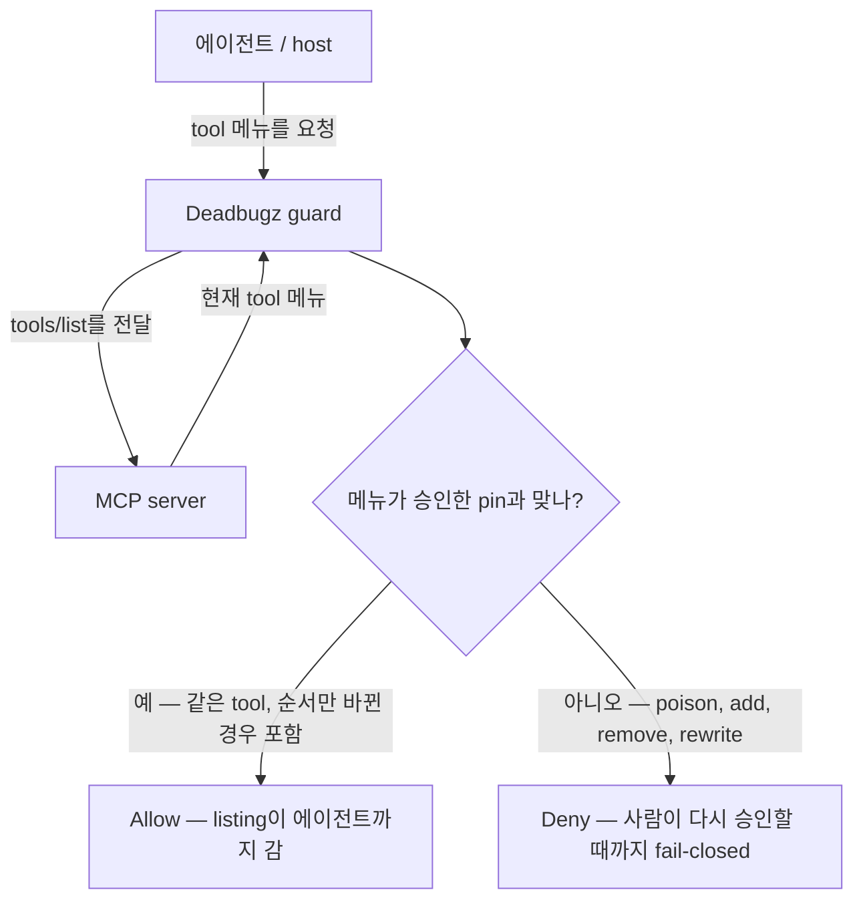

# Deadbugz guard

English: [README.md](README.md)

도구 메뉴에 걸어 둔 자물쇠라고 생각하면 됩니다. 어시스턴트가 보는 MCP tool이, 이미 승인한 목록과 아직 같은지 확인하는 경비원입니다.

AI 어시스턴트(예: Cursor)가 Filesystem MCP 같은 helper와 이야기하면, helper는 tool 메뉴를 내놓습니다. 그 메뉴가 몰래 바뀌면 — 새 tool이 생기거나, description이 고쳐지거나, 정의가 통째로 바뀌면 — 어시스턴트가 승인한 적 없는 일을 하기 시작합니다. Deadbugz guard는 어시스턴트와 helper 사이에 붙어서, 승인한 메뉴를 기억해 두고, 메뉴가 더 이상 맞지 않으면 listing을 막습니다. 이미 쓰는 MCP 경로를 대체하지 않습니다. 옆에 붙는 겁니다.

[Star](https://github.com/furyheimdall/toolfence-deadbugz-guard) · [설치](#설치) · [문서](docs/landing.md)

고정된 계약은 그대로입니다. **pin → `tools/list` diff → fail-closed re-approval**. 용어와 MVP IN/OUT 박스는 아래에 있습니다. 처음이면 여기부터 보시면 됩니다.

## 간단한 사용 예

| 상황 | Deadbugz guard가 하는 일 |
| --- | --- |
| **Cursor + Filesystem MCP** | 이미 돌리는 서버를 wrap합니다: `deadbugz-guard -- <server>`. host는 기존 MCP 경로를 그대로 쓰고, wrap이 tool 정의가 몰래 바뀌는 걸 막습니다. |
| **Poisoned `tools/list`** | 고쳐지거나, 추가되거나, 빠진 tool은 mismatch입니다. guard는 **deny**하고, 사람이 새 pin을 다시 승인할 때까지 **fail-closed**입니다. |
| **Reorder-only `tools/list`** | 승인한 같은 tool이 순서만 바뀌어 옵니다. guard는 **allow**합니다. 순서는 변경이 아닙니다. |

이 세 가지는 스모크 표와 같습니다: benign / reorder → allow; poison / add / remove → deny.

## 검사는 이렇게 돌아갑니다



같은 경로를 그림으로: 

스모크 비교 (benign allow vs poison deny): [docs/assets/smoke-allow-deny.svg](docs/assets/smoke-allow-deny.svg) · 다시 돌려보기: [docs/demo.md](docs/demo.md).

Deadbugz triangle의 OSS 파일럿입니다. **pin → diff → fail-closed re-approval**, 그리고 그 경로에 필요한 최소 HITL(사람이 중간에 개입)과 로컬 audit hook만 더합니다.

## 참여하기

Good first issues — IN 루프에 해당하는 이슈만 ([CONTRIBUTING](CONTRIBUTING.md#good-first-issues)):

- [#3](https://github.com/furyheimdall/toolfence-deadbugz-guard/issues/3) hash-pin
- [#4](https://github.com/furyheimdall/toolfence-deadbugz-guard/issues/4) `tools/list` diff
- [#8](https://github.com/furyheimdall/toolfence-deadbugz-guard/issues/8) audit JSONL

## 언어

**Go** (module `github.com/furyheimdall/toolfence-deadbugz-guard`).

sidecar를 정적 바이너리 하나로 배포하고, 표준 라이브러리만으로 stdio를 쓰고, 이미 합쳐진 `core` / `hitl` / `audit` 패키지(#12)와 맞추려고 골랐습니다. Rust도 검토했지만, 언어를 둘로 나누면 rebase가 커져서 접었습니다.

## 붙이는 방법

| Mode | 역할 |
| --- | --- |
| **1st / primary** | stdio wrap `deadbugz-guard -- <server>` |
| **beside** | Docker / mcp-gateway (`docker-compose.yml`) |
| **AGT** | 옆에 두는 참고일 뿐입니다. 이름이나 코드를 베끼지 마세요 |

전체 stdio / 멀티서버 gateway 제품이 **아닙니다** (epic OUT).

## Pipelock과 비교하면

Pipelock은 drift detect가 있는 전체 egress firewall입니다. Deadbugz는 재승인할 때까지 fail-closed로 막는 얇은 durable-pin sidecar입니다.

공개된 OSS 중에서 가장 가까운 peer는 Pipelock입니다 (~835★). 전체 **egress firewall** 제품이고, SHA-256 drift detect와 `action:ask` HITL은 그중 기능 하나입니다. 세션/스캔 쪽에 가깝습니다. 참고로 Pipelock 가격은 **Founding Pro $49/mo**입니다 (우리 가격이 아닙니다).

Deadbugz guard의 축은 **durable pin**입니다. pin → 현재 `tools/list` **diff** → **HITL re-approval 전까지 fail-closed**. host MCP 경로 옆에 붙는 얇은 sidecar/plugin입니다.

## 핵심 루프

1. 승인한 MCP tool 정의를 **hash-pin**합니다.
2. listing이 올 때마다 현재 `tools/list`를 그 pin과 **diff**합니다. host가 목록을 보기 **전에** 해시하고, `list_changed` 뒤의 guard 자체 refresh도 같은 검사를 합니다.
3. 맞지 않으면 → **fail closed**하고, 새 정의를 믿기 전에 **재승인(re-approval)**을 요구합니다.

HITL과 audit는 그 재승인 경로를 받쳐 주기 위해서만 있습니다. host의 `list_changed` / deferred-tool refresh(그리고 그걸 잘못 다루는 Claude Code 버그)는 보안 경계가 **아닙니다**. [SECURITY.md](SECURITY.md#host-list_changed-is-not-a-security-boundary)를 보세요.

## 설치

```bash
git clone https://github.com/furyheimdall/toolfence-deadbugz-guard.git
cd toolfence-deadbugz-guard

go build -o bin/deadbugz-guard ./cmd/deadbugz-guard
go build -o bin/mock-mcp-deadbugz ./cmd/mock-mcp-deadbugz

# write a pin from the benign fixture (uses core.PinTools)
./bin/deadbugz-guard --write-pin --pin testdata/pin.json --from-mode benign

# primary attach: stdio wrap
./bin/deadbugz-guard --pin testdata/pin.json --audit testdata/audit.jsonl \
  --hitl http://127.0.0.1:8765 --call-gate 3 -- ./bin/mock-mcp-deadbugz
```

host plugin 형태 (Cursor / Claude Desktop 스타일)는 [`examples/plugin.json`](examples/plugin.json)에 있습니다. 한 장짜리: [plugin guide](docs/plugin-guide.md). Cursor에서 Filesystem + Fetch를 60초 안에 wrap하려면: [plugin guide — Cursor 60-second CTA](docs/plugin-guide.md#cursor-60-second-cta).

Flags / env: `--pin` / `PIN_PATH`, `--audit` / `AUDIT_PATH`, `--hitl` / `HITL_ENDPOINT`, `--call-gate` / `CALL_GATE` (Deadbugz path, default **3**).

## Compose (옆에 붙이기)

```bash
go run ./cmd/deadbugz-guard --write-pin --pin testdata/pin.json --from-mode benign
docker compose up --build
```

compose 안에서도 `deadbugz-guard`는 primary wrap 형태를 씁니다: `deadbugz-guard -- mock-mcp-deadbugz`.

## 스모크 테스트

```bash
./scripts/smoke.sh
```

| Case | Result |
| --- | --- |
| **benign** (pinned) | **allow** |
| **reorder** | **allow** |
| **poison** | **deny** (fail-closed) |
| **add** / **remove** | **fail-closed** |
| **deadbugz** + **`call_gate=3`** | gate 이후 `tools/call`을 block |

`FLIP_PATH`는 JSON 상태 파일입니다 `{ "mode": "benign\|poison\|add\|remove\|reorder\|deadbugz", "call_gate": 3 }`. 모드 변경은 **atomic `mv`만** 씁니다 (`WriteFlip`: temp write → rename). 예: [`testdata/flip.json`](testdata/flip.json).

Allow vs deny 그림: [docs/assets/smoke-allow-deny.svg](docs/assets/smoke-allow-deny.svg) · 다시 돌리는 방법: [docs/demo.md](docs/demo.md).

## MVP IN / OUT (고정)

**IN:** Deadbugz triangle (hash-pin → `tools/list` diff → fail-closed re-approval) + sidecar/plugin으로서의 최소 HITL/audit만.

**OUT:** 전체 MCP gateway, SaaS, prompt guardrails.

이 쌍이 계약입니다. IN을 키우지 마세요. OUT에 있는 걸 feature로 다루지 마세요. 트래킹 이슈 #1–#8은 IN만 나눈 이슈입니다.

## 이건 아닙니다

Deadbugz guard는 **얇은 sidecar/plugin**입니다. 제품 카테고리를 바꿔 끼는 물건이 아닙니다.

| 이건 | 이건 아닙니다 |
| --- | --- |
| `tools/list`에 대한 pin → diff → fail-closed 검사 | 에이전트의 정문으로 돌리는 멀티서버 MCP gateway나 stdio multiplexer |
| host의 기존 MCP 경로 옆에 붙는 plugin | control plane, policy mesh, 또는 "모든 tool call을 승인하는" broker |
| re-pin / 재승인을 위한 HITL + 로컬 JSONL만 | prompt filtering, jailbreak scoring, content guardrails |
| 로컬, self-hosted OSS | SaaS 견적 플로우, tenant console, 유료 SKU |

전체 gateway, 원격 SIEM, 또는 prompt 레이어 제품이 필요하면 여기 범위 밖입니다. 먼저 이슈를 여세요. 그런 걸 그냥 PR로 보내지 마세요.

## 문서

- [Landing](docs/landing.md) — OSS 파일럿 포지셔닝
- [Launch note](docs/launch-note.md) — 한 줄 포지션, 설치/랜딩 링크, GitHub About에 붙여 넣을 문구
- [Plugin guide](docs/plugin-guide.md) — `examples/plugin.json`으로 Cursor / Claude Desktop wrap. [Cursor 60초 Filesystem + Fetch CTA](docs/plugin-guide.md#cursor-60-second-cta)
- [흐름도](#검사는-이렇게-돌아갑니다) — Agent → Deadbugz guard → MCP server, allow vs deny ([SVG](docs/assets/flow-allow-deny.svg))
- [Demo](docs/demo.md) — benign → allow vs poison → deny, 그리고 스모크 replay
- [Security](SECURITY.md) — MVP 루프의 threat model
- [Contributing](CONTRIBUTING.md) — 범위 규칙과 PR 체크리스트

## 라이선스

MIT

## 트래킹

- Epic: [#1](https://github.com/furyheimdall/toolfence-deadbugz-guard/issues/1)
- [#2](https://github.com/furyheimdall/toolfence-deadbugz-guard/issues/2) Scaffold (E3)
- [#3](https://github.com/furyheimdall/toolfence-deadbugz-guard/issues/3) hash-pin (E1)
- [#4](https://github.com/furyheimdall/toolfence-deadbugz-guard/issues/4) tools/list diff (E1)
- [#5](https://github.com/furyheimdall/toolfence-deadbugz-guard/issues/5) fail-closed gate (E1)
- [#6](https://github.com/furyheimdall/toolfence-deadbugz-guard/issues/6) HITL hook (E2)
- [#7](https://github.com/furyheimdall/toolfence-deadbugz-guard/issues/7) sidecar/plugin + smoke (E3)
- [#8](https://github.com/furyheimdall/toolfence-deadbugz-guard/issues/8) audit JSONL (E2)

## 패키지 구조 (Go MVP)

`core` (merge된 #12 타입 + 얇은 `MemoryGate` adapter), `hitl` (#6), `audit` (#8), `sidecar` (#7 wrap). 여기서 `core` seat를 다시 정의하지 않습니다.

```
core/     ToolDiffSummary, GateDecision, ReasonCode, Pin, Gate, MemoryGate, PinTools
hitl/     Approver (#6)
audit/    JSONL Auditor (#8)
sidecar/  deadbugz-guard stdio wrap (uses core.Gate)
cmd/deadbugz-guard
cmd/mock-mcp-deadbugz
cmd/hitl
cmd/audit
```

공개 gate 어휘 (이슈 #5 / #12): `ToolDiffSummary`, `GateDecision`, `ReasonCode` (`OK`, `DIFF_NONEMPTY`, `APPROVAL_DENIED`, `APPROVAL_PENDING`, `PIN_MISSING`, `INTERNAL_ERROR`). `Approver.RequestApproval`은 `ToolDiffSummary`와 candidate pin을 받습니다. `ApplyApproval(pin_revision, approve|deny)`는 `GateDecision`을 돌려줍니다. timeout은 deny입니다.

Epic #1 호환 매트릭스 (A–J): E2가 **G** / **H**와 audit을 담당합니다. E3 attach는 stdio wrap `deadbugz-guard -- <server>`입니다.

## HITL stub (#6)

로컬만입니다. callback, CLI, 또는 작은 HTTP stub. SaaS 없습니다.

```bash
# terminal 1 — stub
go run ./cmd/hitl serve -listen 127.0.0.1:8765

# terminal 2 — blocks on ToolDiffSummary + candidate pin (timeout = deny / Chief H)
go run ./cmd/hitl request -base http://127.0.0.1:8765 -timeout 60

# terminal 3 — decide (Chief G: approve advances newHash; deny keeps old pin)
go run ./cmd/hitl decide -base http://127.0.0.1:8765 -decision approve -who alice
# or:  go run ./cmd/hitl decide -decision deny -who alice
```

sidecar/테스트는 `hitl.CallbackApprover` 또는 같은 `hitl.Server`를 `core.Approver`로 주입합니다. Approve → `ApplyApproval(..., approve)`이고 pin이 candidate hash가 됩니다. Deny/timeout → `ApplyApproval(..., deny)`이고 예전 pin을 유지합니다.

## Audit CLI (#8)

추가만 하는(append-only) JSONL입니다. 이벤트: `pin_created`, `diff_detected`, `blocked`, `approved`, `denied`. 해시가 바뀔 때는 `oldHash` / `newHash`를 남기고, 재승인할 때는 `who` / `when`도 남깁니다.

redaction-safe allowlist (이 키만 기록합니다): `event`, `when`, `who`, `oldHash`, `newHash`, `pin_revision`, `pin_hash`, `live_hash`, `added`, `removed`, `changed`, `reason_code`, `decision`, `approved_version`. 시크릿, raw tool args, `inputSchema`는 넣지 않습니다.

```bash
go test ./...
go run ./cmd/audit -path ./audit.jsonl tail -n 20
```
