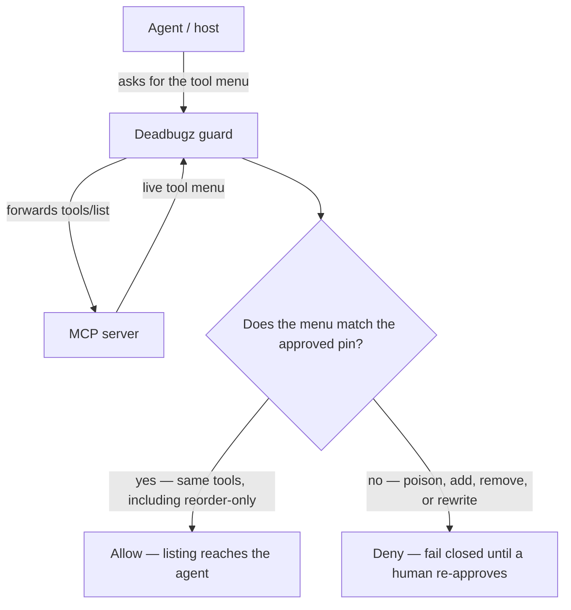
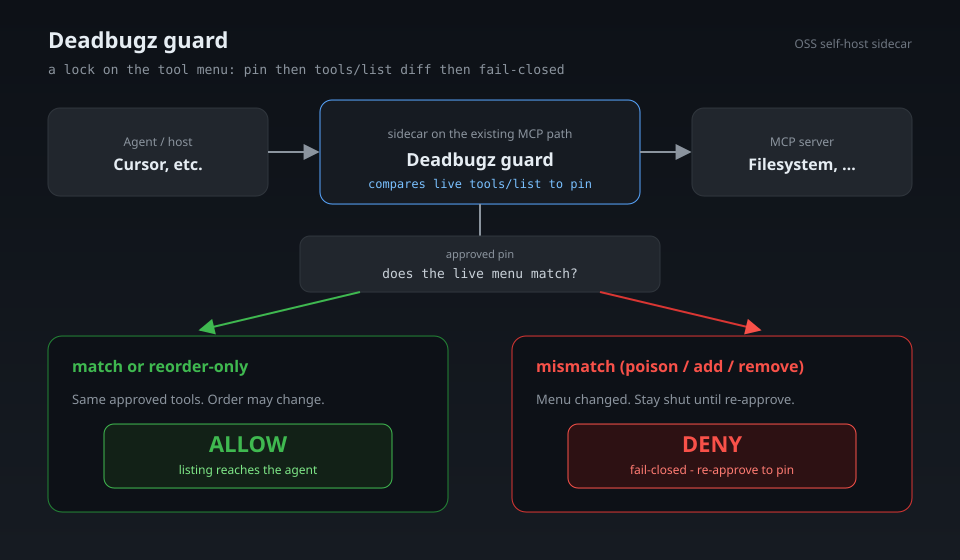

# Deadbugz guard

한국어: [README.ko.md](README.ko.md)

Think of it as a lock on the tool menu: a guard that checks whether the MCP tools your assistant can see still match the list you already approved.

When an AI assistant (for example Cursor) talks to a helper program such as a Filesystem MCP, that helper advertises a menu of tools. If the menu changes quietly — a new tool appears, a description is rewritten, a definition is swapped — the assistant can start doing things you never signed off on. Deadbugz guard sits between the assistant and that helper, remembers the approved menu, and stops the listing when the menu no longer matches. It does not replace the MCP path you already use; it sits beside it.

[Star](https://github.com/furyheimdall/toolfence-deadbugz-guard) · [Install](#install) · [Docs](docs/landing.md)

The locked contract is still **pin → `tools/list` diff → fail-closed re-approval**. Jargon and the MVP IN/OUT box are below; start here if you are new.

## Simple usecases

| Situation | What Deadbugz guard does |
| --- | --- |
| **Cursor + a Filesystem MCP** | Wrap the server you already run: `deadbugz-guard -- <server>`. The host keeps its MCP path; the wrap stops tool definitions from changing silently. |
| **Poisoned `tools/list`** | A rewritten, added, or removed tool is a mismatch. The guard **denies** and **fails closed** until a human re-approves a new pin. |
| **Reorder-only `tools/list`** | The same approved tools come back in a different order. The guard **allows**. Order is not a change. |

Those three match the smoke table: benign / reorder → allow; poison / add / remove → deny.

## How the check works



Same path as a picture: 

Smoke pair (benign allow vs poison deny): [docs/assets/smoke-allow-deny.svg](docs/assets/smoke-allow-deny.svg) · replay: [docs/demo.md](docs/demo.md).

OSS pilot of the Deadbugz triangle: **pin → diff → fail-closed re-approval**, plus the minimum HITL and local audit hooks that path needs.

## Get involved

Good first issues — IN-loop slices only ([CONTRIBUTING](CONTRIBUTING.md#good-first-issues)):

- [#3](https://github.com/furyheimdall/toolfence-deadbugz-guard/issues/3) hash-pin
- [#4](https://github.com/furyheimdall/toolfence-deadbugz-guard/issues/4) `tools/list` diff
- [#8](https://github.com/furyheimdall/toolfence-deadbugz-guard/issues/8) audit JSONL

## Language

**Go** (module `github.com/furyheimdall/toolfence-deadbugz-guard`).

Chosen so the sidecar ships as one static binary, speaks stdio with the standard library, and matches the merged `core` / `hitl` / `audit` packages (#12). Rust was considered and dropped to avoid a dual-language rebase.

## Attach

| Mode | Role |
| --- | --- |
| **1st / primary** | stdio wrap `deadbugz-guard -- <server>` |
| **beside** | Docker / mcp-gateway (`docker-compose.yml`) |
| **AGT** | juxtaposition reference only — do not copy names or code |

This is **not** a full stdio / multi-server gateway product (epic OUT).

## Mapping vs AGT

AGT is the nearest public OSS *pattern*: a process that sits next to a tool server and observes the listing path. This pilot copies that **boundary** only (wrap vs target). It does not copy AGT source, names, or proprietary structure.

## Core loop

1. **Hash-pin** approved MCP tool definitions.
2. **Diff** the live `tools/list` against that pin on every listing.
3. On mismatch → **fail closed** and require **re-approval** before the new definitions are trusted.

HITL and audit exist only to support that re-approval path.

## Install

```bash
git clone https://github.com/furyheimdall/toolfence-deadbugz-guard.git
cd toolfence-deadbugz-guard

go build -o bin/deadbugz-guard ./cmd/deadbugz-guard
go build -o bin/mock-mcp-deadbugz ./cmd/mock-mcp-deadbugz

# write a pin from the benign fixture (uses core.PinTools)
./bin/deadbugz-guard --write-pin --pin testdata/pin.json --from-mode benign

# primary attach: stdio wrap
./bin/deadbugz-guard --pin testdata/pin.json --audit testdata/audit.jsonl \
  --hitl http://127.0.0.1:8765 --call-gate 3 -- ./bin/mock-mcp-deadbugz
```

Host plugin shape (Cursor / Claude Desktop style) is in [`examples/plugin.json`](examples/plugin.json). One-pager: [plugin guide](docs/plugin-guide.md).

Flags / env: `--pin` / `PIN_PATH`, `--audit` / `AUDIT_PATH`, `--hitl` / `HITL_ENDPOINT`, `--call-gate` / `CALL_GATE` (Deadbugz path, default **3**).

## Compose (beside)

```bash
go run ./cmd/deadbugz-guard --write-pin --pin testdata/pin.json --from-mode benign
docker compose up --build
```

`deadbugz-guard` in compose still uses the primary wrap form: `deadbugz-guard -- mock-mcp-deadbugz`.

## Smoke test

```bash
./scripts/smoke.sh
```

| Case | Result |
| --- | --- |
| **benign** (pinned) | **allow** |
| **reorder** | **allow** |
| **poison** | **deny** (fail-closed) |
| **add** / **remove** | **fail-closed** |
| **deadbugz** + **`call_gate=3`** | block `tools/call` after gate |

`FLIP_PATH` is a JSON state file `{ "mode": "benign\|poison\|add\|remove\|reorder\|deadbugz", "call_gate": 3 }`. Mode changes use **atomic `mv` only** (`WriteFlip`: temp write → rename). Example: [`testdata/flip.json`](testdata/flip.json).

Allow vs deny visual: [docs/assets/smoke-allow-deny.svg](docs/assets/smoke-allow-deny.svg) · how to re-run: [docs/demo.md](docs/demo.md).

## MVP IN / OUT (locked)

**IN:** Deadbugz triangle (hash-pin → `tools/list` diff → fail-closed re-approval) + minimal HITL/audit as sidecar/plugin only.

**OUT:** Full MCP gateway, SaaS, prompt guardrails.

That pair is the contract. Do not grow IN. Do not treat anything in OUT as a feature. Tracking issues #1–#8 are slices of IN only.

## Not this

Deadbugz guard is a **thin sidecar/plugin**, not a product category swap-in.

| This is | This is not |
| --- | --- |
| A pin → diff → fail-closed check on `tools/list` | A multi-server MCP gateway or stdio multiplexer you run as the agent’s front door |
| A plugin that sits beside the host’s existing MCP path | A control plane, policy mesh, or “approve every tool call” broker |
| HITL + local JSONL only for re-pin / re-approval | Prompt filtering, jailbreak scoring, or content guardrails |
| Local, self-hosted OSS | A SaaS quote flow, tenant console, or billed SKU |

If a change needs a full gateway, remote SIEM, or prompt-layer product, it is out of scope here. Open an issue first; do not send that as a drive-by PR.

## Docs

- [Landing](docs/landing.md) — positioning for the OSS pilot
- [Launch note](docs/launch-note.md) — one-line position, Install/landing links, GitHub About paste
- [Plugin guide](docs/plugin-guide.md) — Cursor / Claude Desktop wrap via `examples/plugin.json`
- [Flow diagram](#how-the-check-works) — Agent → Deadbugz guard → MCP server, allow vs deny ([SVG](docs/assets/flow-allow-deny.svg))
- [Demo](docs/demo.md) — benign → allow vs poison → deny, plus smoke replay
- [Security](SECURITY.md) — threat model for the MVP loop
- [Contributing](CONTRIBUTING.md) — scope rules and PR checklist

## License

MIT

## Tracking

- Epic: [#1](https://github.com/furyheimdall/toolfence-deadbugz-guard/issues/1)
- [#2](https://github.com/furyheimdall/toolfence-deadbugz-guard/issues/2) Scaffold (E3)
- [#3](https://github.com/furyheimdall/toolfence-deadbugz-guard/issues/3) hash-pin (E1)
- [#4](https://github.com/furyheimdall/toolfence-deadbugz-guard/issues/4) tools/list diff (E1)
- [#5](https://github.com/furyheimdall/toolfence-deadbugz-guard/issues/5) fail-closed gate (E1)
- [#6](https://github.com/furyheimdall/toolfence-deadbugz-guard/issues/6) HITL hook (E2)
- [#7](https://github.com/furyheimdall/toolfence-deadbugz-guard/issues/7) sidecar/plugin + smoke (E3)
- [#8](https://github.com/furyheimdall/toolfence-deadbugz-guard/issues/8) audit JSONL (E2)

## Package layout (Go MVP)

`core` (merged #12 types + thin `MemoryGate` adapter), `hitl` (#6), `audit` (#8), `sidecar` (#7 wrap). This PR does **not** redefine `core` seats.

```
core/     ToolDiffSummary, GateDecision, ReasonCode, Pin, Gate, MemoryGate, PinTools
hitl/     Approver (#6)
audit/    JSONL Auditor (#8)
sidecar/  deadbugz-guard stdio wrap (uses core.Gate)
cmd/deadbugz-guard
cmd/mock-mcp-deadbugz
cmd/hitl
cmd/audit
```

Public gate vocabulary (issue #5 / #12): `ToolDiffSummary`, `GateDecision`, `ReasonCode` (`OK`, `DIFF_NONEMPTY`, `APPROVAL_DENIED`, `APPROVAL_PENDING`, `PIN_MISSING`, `INTERNAL_ERROR`). `Approver.RequestApproval` takes a `ToolDiffSummary` and candidate pin. `ApplyApproval(pin_revision, approve|deny)` returns `GateDecision`. Timeout is deny.

Epic #1 compat matrix (A–J): E2 owns **G** / **H** plus audit. E3 attach is stdio wrap `deadbugz-guard -- <server>`.

## HITL stub (#6)

Local only — callback, CLI, or tiny HTTP stub. No SaaS.

```bash
# terminal 1 — stub
go run ./cmd/hitl serve -listen 127.0.0.1:8765

# terminal 2 — blocks on ToolDiffSummary + candidate pin (timeout = deny / Chief H)
go run ./cmd/hitl request -base http://127.0.0.1:8765 -timeout 60

# terminal 3 — decide (Chief G: approve advances newHash; deny keeps old pin)
go run ./cmd/hitl decide -base http://127.0.0.1:8765 -decision approve -who alice
# or:  go run ./cmd/hitl decide -decision deny -who alice
```

Sidecar/tests inject `hitl.CallbackApprover` or the same `hitl.Server` as `core.Approver`. Approve → `ApplyApproval(..., approve)` and pin becomes the candidate hash. Deny/timeout → `ApplyApproval(..., deny)` and the old pin is kept.

## Audit CLI (#8)

Append-only JSONL. Events: `pin_created`, `diff_detected`, `blocked`, `approved`, `denied`. Hash transitions record `oldHash` / `newHash`; re-approve also records `who` / `when`.

Redaction-safe allowlist (only these keys are written): `event`, `when`, `who`, `oldHash`, `newHash`, `pin_revision`, `pin_hash`, `live_hash`, `added`, `removed`, `changed`, `reason_code`, `decision`, `approved_version`. No secrets, raw tool args, or `inputSchema`.

```bash
go test ./...
go run ./cmd/audit -path ./audit.jsonl tail -n 20
```
